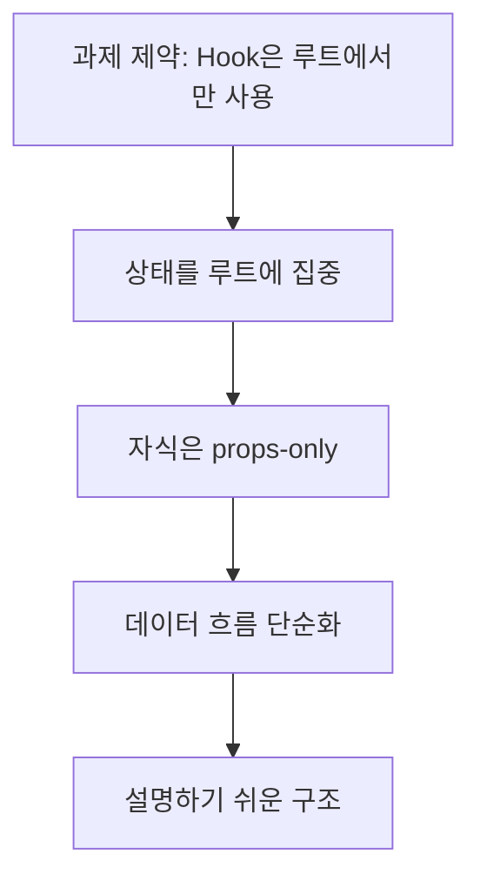
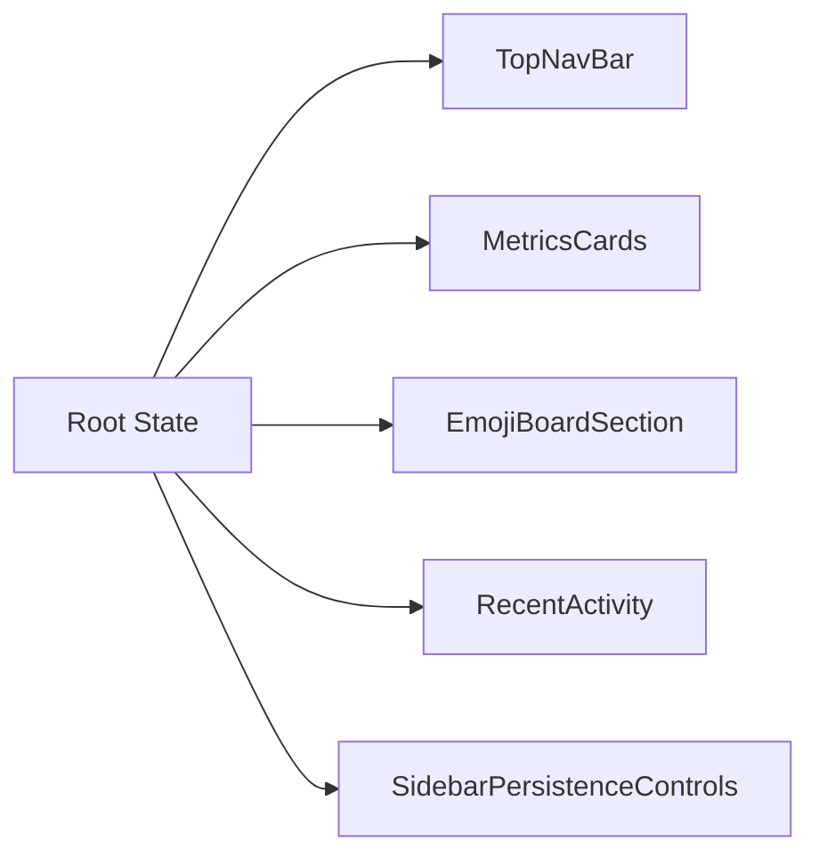
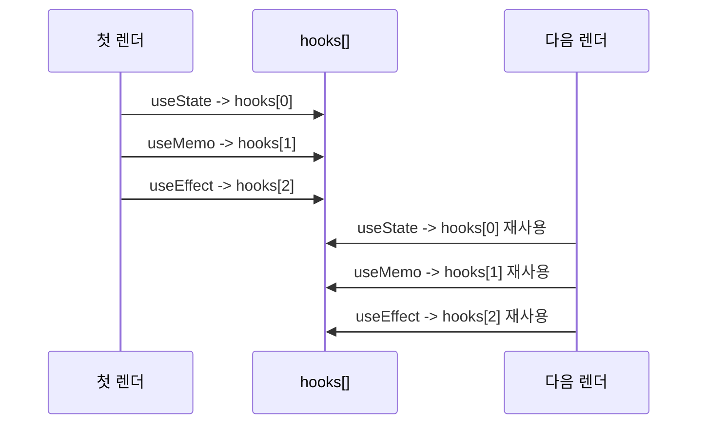
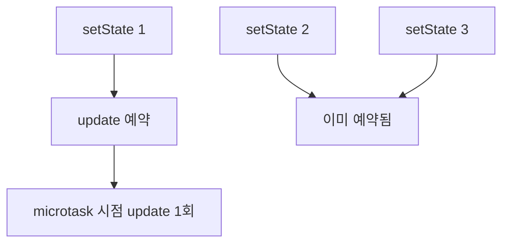
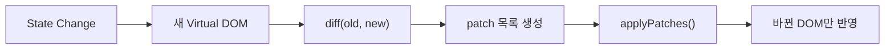

# Baby React

---

## 한 장 요약

| 선택 포인트 | 현재 구현 | 왜 이 방식을 택했는가 | 다른 방법 |
| --- | --- | --- | --- |
| 상태 위치 | 루트에 집중 | Hook을 루트에서만 쓰는 조건을 가장 단순하게 만족 | 공통 부모별 분산, 전역 store |
| 자식 컴포넌트 | props-only 순수 함수 | 상태 흐름을 단방향으로 유지하고 설명을 단순화 | 자식도 local state 보유 |
| Hook 저장 방식 | `hooks[] + hookIndex` | Hook 순서 기반 상태 보존을 가장 직관적으로 표현 | `Map`, 타입별 배열, linked list |
| 상태 변경 처리 | `setState -> scheduleUpdate()` | 상태 변경과 리렌더를 자동 연결 | `setState -> 즉시 update()` |
| batching | `queueMicrotask()` | 여러 상태 변경을 1번 렌더로 묶기 쉬움 | `setTimeout`, `requestAnimationFrame`, 전역 큐 |
| 화면 갱신 | Diff 후 Patch | 전체 재렌더 대신 필요한 부분만 수정 | subtree 교체, 전체 DOM 재생성 |
| 디버깅 | Debug Panel 추가 | 내부 동작까지 발표에서 보여주기 좋음 | 화면 결과만 보여주기 |

---

## 왜 이 구조를 골랐는가

이 프로젝트는 실제 React와 최대한 비슷하게 만들기보다,  
**과제 제약 안에서 핵심 개념을 가장 분명하게 보여주는 구조**를 우선했습니다.

그 결과 선택한 구조는 다음과 같습니다.

- 상태는 루트에서만 관리
- 자식은 stateless component
- Hook은 `hooks[]` 배열에 저장
- 상태 변경은 batching 후 한 번만 렌더
- 화면 갱신은 Diff/Patch로 최소 반영

---

## 선택 1. 왜 상태를 루트에 두었는가

| 항목 | 내용 |
| --- | --- |
| 선택 | 모든 state를 루트 컴포넌트에 집중 |
| 이유 | Hook을 루트에서만 사용한다는 조건을 가장 자연스럽게 만족 |
| 장점 | 데이터 흐름이 단방향이라 디버깅과 발표가 쉬움 |
| 단점 | 상태가 많아질수록 루트가 커질 수 있음 |
| 대안 | 자식 또는 공통 부모에 state를 나누는 방식 |

이 선택 덕분에 자식 컴포넌트는 "데이터를 받아서 보여주는 역할"에만 집중할 수 있습니다.

---

## 선택 2. 왜 자식을 props-only로 만들었는가

| 항목 | 내용 |
| --- | --- |
| 선택 | 자식 컴포넌트는 상태 없는 순수 함수 |
| 이유 | Lifting State Up을 가장 명확하게 보여줄 수 있기 때문 |
| 장점 | 각 컴포넌트 책임이 분명해지고, 구조 설명이 쉬움 |
| 단점 | 실제 React처럼 자식이 독립 상태를 가질 수는 없음 |
| 대안 | 각 자식에 독립 state와 Hook 저장소를 두는 방식 |

이 구조는 "루트가 데이터와 동작을 가진다, 자식은 화면을 렌더링한다"는 역할 분리를 강조합니다.

---

## 선택 3. 왜 `hooks[] + hookIndex`를 썼는가

| 항목 | 내용 |
| --- | --- |
| 선택 | Hook 상태를 `hooks[]` 배열에 저장 |
| 이유 | Hook의 본질인 "호출 순서 기반 상태 보존"을 가장 단순하게 구현 가능 |
| 장점 | 설명력이 높고 구현이 짧음 |
| 단점 | Hook 순서가 바뀌면 구조가 매우 취약함 |
| 대안 | `Map`, 타입별 배열, linked list |

이 방식은 "함수는 다시 실행되지만 상태는 배열에 남는다"는 점을 가장 직관적으로 보여줍니다.

---

## 선택 4. 왜 `setState -> scheduleUpdate()`를 택했는가

| 항목 | 내용 |
| --- | --- |
| 선택 | 상태 변경 직후 바로 렌더하지 않고 update 예약 |
| 이유 | 상태 변경과 UI 갱신을 자동으로 연결하기 위해 |
| 장점 | 같은 값은 생략하고, 실제 변경만 렌더로 이어짐 |
| 단점 | 즉시 반영 구조보다 로직이 한 단계 더 있음 |
| 대안 | `setState`가 바로 `update()` 호출 |

이 선택 덕분에 `setState`는 단순 대입이 아니라 **렌더 사이클의 시작점**이 됩니다.

---

## 선택 5. 왜 batching을 넣었는가

| 항목 | 내용 |
| --- | --- |
| 선택 | `queueMicrotask()` 기반 batching |
| 이유 | 같은 tick 안의 여러 상태 변경을 1번 렌더로 묶기 위해 |
| 장점 | 구현이 짧고 React의 batching 개념을 설명하기 좋음 |
| 단점 | 실제 React처럼 우선순위 제어는 없음 |
| 대안 | `setTimeout`, `requestAnimationFrame`, 전역 스케줄러 |

이 구조는 "상태가 세 번 바뀌어도 렌더는 한 번만 일어난다"는 점을 분명하게 보여줍니다.

---

## 선택 6. 왜 Diff/Patch를 유지했는가

| 항목 | 내용 |
| --- | --- |
| 선택 | 새 Virtual DOM 생성 후 Diff/Patch |
| 이유 | 전체를 다시 그리지 않고 필요한 부분만 바꾸는 목표를 직접 보여주기 위해 |
| 장점 | 기존 Virtual DOM 엔진을 재사용하면서 최소 업데이트 가능 |
| 단점 | path 계산과 patch 적용 로직을 따로 관리해야 함 |
| 대안 | 전체 DOM 재생성, subtree 단위 교체 |

이 선택은 과제 목표인 **"필요한 부분만 업데이트"** 를 가장 직접적으로 설명합니다.

---

## 데모는 무엇을 증명하는가

| 데모 행동 | 보여주는 것 |
| --- | --- |
| 이모지 클릭 | 루트 상태 하나가 여러 UI를 동시에 바꾼다는 점 |
| Debug Panel | 액션, 렌더 추적, patch 요약이 실제로 생성된다는 점 |
| Save / Reset / Restore | 상태 저장, 초기화, 복원 흐름이 동작한다는 점 |

즉, 데모는 예쁜 화면 자체보다 **선택한 런타임 구조가 실제로 작동한다는 증거**에 가깝습니다.

---

## 현재 구현 vs 실제 React

| 항목 | 현재 구현 | 실제 React |
| --- | --- | --- |
| 상태 단위 | 루트 FunctionComponent 하나 | 각 함수 컴포넌트마다 독립 상태 |
| Hook 사용 위치 | 루트만 허용 | 모든 함수형 컴포넌트 |
| 상태 저장 | `hooks[]` 배열 | Fiber 기반 Hook 구조 |
| batching | `queueMicrotask` 기반 | 더 정교한 scheduler |
| 렌더 비교 | vDOM diff 후 patch | Fiber reconciliation |
| 리스트 처리 | 단순 비교 중심, 일부 keyed diff | 강한 key 기반 reconciliation |
| effect 실행 | patch 직후 flush | 더 정교한 렌더/커밋 단계 분리 |

핵심은 실제 React를 완전히 재현하는 것이 아니라,  
**왜 React가 그런 구조를 가지는지 이해할 수 있을 정도로 핵심을 압축해서 보여주는 것**입니다.

---
